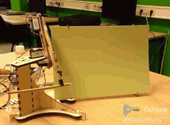
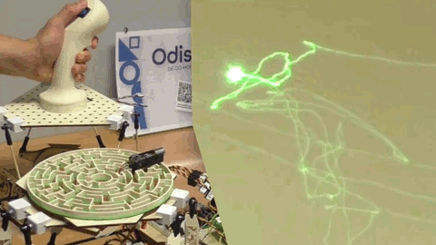
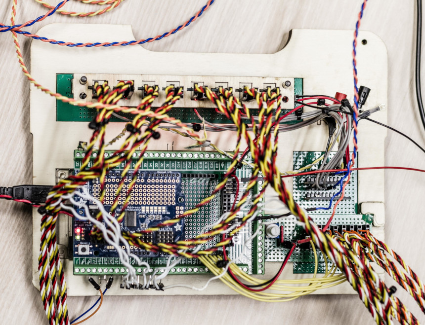
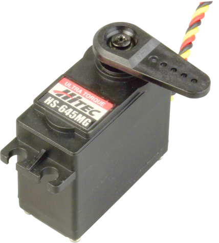
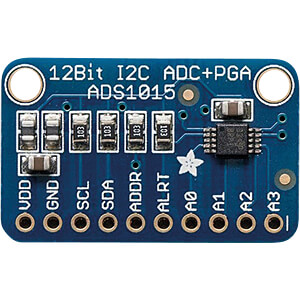
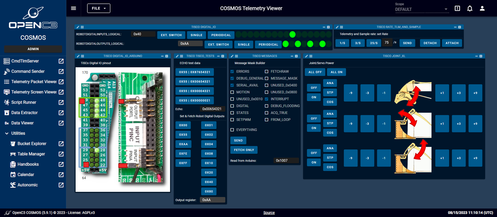
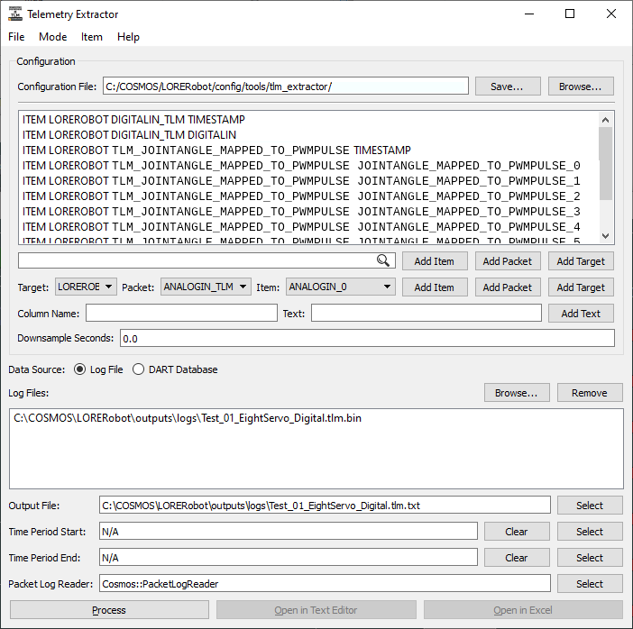
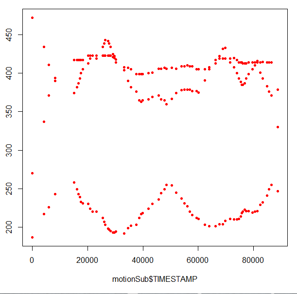
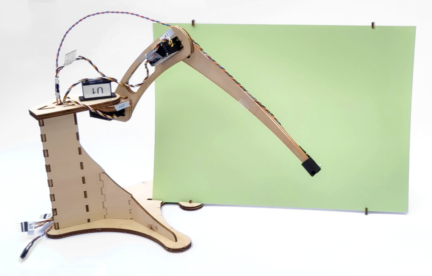

<!-- PROJECT LOGO -->
<!--
 

  

-->

<h3 align="center">TiSCo project</h3>

  

    Teach-in Servo Controller
     
    A framework of robot control software and IT hardware to complement
     
    the mechanical aspects of generic educational and hobby robots.
     
    <a href="https://www.youtube.com/playlist?list=PL3EbfoEGlpI9AzfkHhA0ydbFYY-gb1QV5">
    View TiSCo in action (Youtube)</a>
  

    

<!-- TABLE OF CONTENTS -->
<!-- vscode-markdown-toc -->
* 1. [About the project](#Abouttheproject)
	* 1.1. [Programming a Robot by Teaching it](#ProgrammingaRobotbyTeachingit)
	* 1.2. [Why this project?](#Whythisproject)
	* 1.3. [Key features](#Keyfeatures)
* 2. [Hardware](#Hardware)
* 3. [OpenC3 COSMOS Control Software](#OpenC3COSMOSControlSoftware)
* 4. ['Proof of Concept' Development Prototype](#ProofofConceptDevelopmentPrototype)
* 5. [Detailed Documentation and More Info](#DetailedDocumentationandMoreInfo)
* 6. [What the Project Doesn't Do](#WhattheProjectDoesntDo)
* 7. [Roadmap](#Roadmap)
* 8. [Contributing](#Contributing)
	* 8.1. [Prioritized todos](#Prioritizedtodos)
		* 8.1.1. [Coding style](#Codingstyle)
		* 8.1.2. [Feature requests](#Featurerequests)
* 9. [License](#License)
* 10. [About me](#Aboutme)

<!-- vscode-markdown-toc-config
	numbering=true
	autoSave=true
	/vscode-markdown-toc-config -->
<!-- /vscode-markdown-toc -->

<!-- Source: Best-README-Template -->

<!-- ABOUT THE PROJECT -->
##  1. About the project
<!--
[![Product Name Screen Shot][product-screenshot]](https://example.com)
-->

The project offers an easy and consistent method to control mechanisms involving 16 hobby servos.

###  1.1. Programming a Robot by Teaching it

The project provides an easy and reliable way to activate various complex mechanisms using hobby servos. A key feature, often missing in most hobby robot control software, is the Teach-in functionality. This allows users to manually move the robot joints in real time, recording the joint angles as the robot is guided through its movements. After [processing the input](#curve-fitting), the robot can accurately replay the recorded motions at any desired speed. This feature enables the execution of extensive and complex movements without needing advanced robotics theories like [Inverse Kinematics](https://en.wikipedia.org/wiki/Inverse_kinematics).

###  1.2. Why this project?

The project empowers hands-on builders to bring their ideas to life, allowing them to focus on the mechanical aspects of their designs, such as material selection, mechanical strength, stiffness-to-weight ratio, mass/weight, durability, manufacturability, sustainability, and cost.

Once the mechanical design is validated, the mechanism can be given to software and microcontroller enthusiasts to develop the necessary robotics control firmware.

###  1.3. Key features

* Based on a standard Arduino Mega 2560 with extra breakout
  boards, and standard hobby servos with small modification.
* Controls up to 16 modified hobby servos.
* No specialized robotics theory like Inverse Kinematics is implemented.
  Complex motions are simply taught using the *Teach-in* feature: just
  manipulate the joints by hand while the joint angles are recorded.
* Three modes of motion:
  * directly mirroring joystick input (normal joystick or custom made using
    [low cost potentiometers](#low_cost_potentiometer)),
  * replaying an earlier recorded motion,
  * executing a stream of COSMOS commands, setting the desired joint
    angles.

TiSCo deals exclusively with the electronics and software. For the
mechanical side of the robots, see the
[AMROD project homepage](https://odisee.be/AMROD)!

(see also [what the project doesn't do](#project-doesnt-do))

(<a href="#top">back to top</a>)

##  2. Hardware

&nbsp;&nbsp;&nbsp;&nbsp;

The controller is a standard Arduino Mega 2560 rev. 3 topped with a
[16 channel PWM servo shield](https://www.adafruit.com/product/1411), driving
up to 16 modified hobby servos (Hitec
[HS-625MG](https://hitecrcd.com/products/servos/sport-servos/analog-sport-servos/hs-625mg/product)
and
[HS-645MG](https://hitecrcd.com/products/servos/sport-servos/analog-sport-servos/hs-645mg/product),
eight are connected in the [prototype](#prototype) of which three actually
drive the mechanism).
Power to the servos is fed by one or more *Weidmuller CP E SNT 100W 5V, 16A*
Switched Mode Power Supply.

&nbsp;&nbsp;&nbsp;&nbsp;

A few [ADS1015 analog to digital breakout boards](https://www.adafruit.com/product/1083)
together with lots of analog input pins, register the angle of modified
low cost potentiometers as well as the servos internal shaft angle.

(<a href="#top">back to top</a>)

##  3. OpenC3 COSMOS Control Software

The robot is controlled by
[OpenC3 COSMOS](https://openc3.com/)
("The software for integration, test, and operations").
Using Command and Telemetry 'screens', all operational instructions, detailed
telemetry and test commands are passed via serial protocol over USB cable.

<!-- Linking to HTML:
- https://stackoverflow.com/questions/6551446/can-i-run-html-files-directly-from-github-instead-of-just-viewing-their-source
-
-->

COSMOS allows for all telemetry data to be stored and to be extracted
for further analysis.
An [R](https://www.r-project.org/) [script](Arduino/R-code/SplineFitServoData.R)
cleans up, curve-fits and resamples the raw telemetry data.
This results in an C++ include file called ``motion_1.h`` (1 or higher) that
contains the motion data, ready to be (re)compiled in the firmware.

(<a href="#top">back to top</a>)

##  4. 'Proof of Concept' Development Prototype

Using the *Teach-In* functionality, setting *any* mechanical construction in motion is effortless. For example, the image shows a three DOF (degrees of freedom) 'proof-of-concept' made from 4mm plywood. Although it lacks the stiffness for proper functionality, it serves well for designing and testing the firmware and COSMOS control software.

[See it in action](https://youtu.be/c8t8TVBJscc) as it draws a logo on a phosphorescent screen with a UV LED. The motion was recorded earlier by tracing the logo from a piece of paper placed on the screen (video from the AMROD [YouTube playlist](https://www.youtube.com/playlist?list=PL3EbfoEGlpI9AzfkHhA0ydbFYY-gb1QV5)). Using a telemetry screen, the PWM pulses used for each joint can be retrieved and displayed while the motion is running.

(<a href="#top">back to top</a>)

##  5. Detailed Documentation and More Info

* Check out the [Doxygen documentation](https://jurgensymynck.github.io/TiSCo_Docs/doxygen) for all detailed documentation.
* Check out the projects [User Specification Documents](https://jurgensymynck.github.io/TiSCo_Docs/specs) for how to use TiSCo (this is a work in progress).
* For the mechanical side of the robots, see the [AMROD project homepage](https://odisee.be/AMROD).

##  6. What the Project Doesn't Do

* The robots do not move autonomously by following high-level commands like "walk forward" or "grip object." Instead, they either mirror analog inputs in real time, replay previously recorded motions, or set the joints according to an incoming stream of COSMOS command packets.
* There is no support for rotary motions like wheels, making [Turtle robots](https://en.wikipedia.org/wiki/Turtle_(robot)) or other mobile robots unfeasible at this time. If a reliable teach-in method for multiple rotations is developed, this feature might be included in the future.
* Battery power supply is not a priority, as the robots cannot move far. Consequently, power consumption is also not a focus, and the robot remains tethered to its power supply.

  
(<a href="#top">back to top</a>)

<!-- GETTING STARTED -->
<!-- ##  6. Getting Started -->
<!-- ###  6.1. Prerequisites

(<a href="#top">back to top</a>)
 -->

<!-- ### Installation

(<a href="#top">back to top</a>)
 -->

<!-- USAGE EXAMPLES -->
<!-- ## Usage

(<a href="#top">back to top</a>)
 -->

<!-- ROADMAP -->
##  7. Roadmap

* [ ] Write detailed instructions on:
  * [ ] Calibration of input potentiometers and joysticks
  * [ ] Calibration of servo internal angle feedback potentiometers,
          setting the safe software limits for servo sweep angles.
  * [ ] Calibration of current sensors
  * [ ] COSMOS usage
  * [ ] recording and replaying motions
* [ ] Improve code comments, expanding the [Doxygen](https://doxygen.nl/)
      generated documentaion.
* [ ] Upgrade the prototype mechanism for much higher stiffness using the
      [Markforged Mark Two](https://markforged.com/3d-printers/mark-two)
      Continuous Fiber Composite 3D Printer, and create comprehensive tutorials
      and demos
* [ ] Create [Battle of the Lores](https://www.youtube.com/watch?v=SlQhWn_OyFU&list=PL3EbfoEGlpI9AzfkHhA0ydbFYY-gb1QV5) video, Round 2 and 3!

<!-- See the [open issues](https://github.com/jurgensymynck/TiSCo_PRIVATE/issues) for a full list of proposed features (and known issues). -->

(<a href="#top">back to top</a>)

<!-- CONTRIBUTING -->
##  8. Contributing

Since this project will be featured in an educational setting, it is essential that it exemplifies good coding practices and the use of embedded Object-Oriented Programming in C++. Additionally, the coding style should closely align with established Arduino coding conventions.

###  8.1. Prioritized todos

####  8.1.1. Coding style

Evaluate the code and suggest better (embedded) coding practices:

* What kind of classes go into which file(s)? How to organize class
    definitions in well-chosen files?
* Correct usage of include files (.h) vs. code files (.cpp).
* Proper implementation of Object Oriented Programming with abstraction,
  encapsulation and inheritance (for code reuse), keeping in mind that the code
  is running on embedded hardware.
  * inheritance <-> composition
  * public/private members and variables
* Make code more readable and maintainable.
* If sensible, refactor large switch() statements using polymorphism,
  for readability.

####  8.1.2. Feature requests

* Implementation of safe serial framed data communication, possibly
  using [COBS](https://en.wikipedia.org/wiki/Consistent_Overhead_Byte_Stuffing)
  or [SLIP](https://en.wikipedia.org/wiki/Serial_Line_Internet_Protocol)
  protocols.
* Move initialization of all joint and robot parameters that are now hardcoded to COSMOS.
  The robot should be initialized after booting, via a series of COSMOS
  initialization commands.
* Upload/download/verify robot motions via COSMOS instead of compiling the
  motions together with the code.
* Move all debug message strings to flash memory instead of SRAM.
* Write test procedures for testing the code base and COSMOS communication.

<!-- LICENSE -->
##  9. License

* The TiSCo source code that is hosted on https://github.com/jurgensymynck/TiSCo is distributed under the GPL-3.0 License.
See [LICENSES](https://github.com/jurgensymynck/TiSCo/LICENSES) for more information.

* The contents of [this documentation repo](https://github.com/jurgensymynck/TiSCo_Docs) is distributed under the MIT License.
See [LICENSES](https://github.com/jurgensymynck/TiSCo_Docs/LICENSES) for more information.

(<a href="#top">back to top</a>)

<!-- CONTACT -->
<!-- ## Contact

Your Name - [@twitter_handle](https://twitter.com/twitter_handle) - email@email_client.com

Project Link: [https://github.com/jurgensymynck/TiSCo_PRIVATE](https://github.com/jurgensymynck/TiSCo_PRIVATE)

(<a href="#top">back to top</a>)
 -->

<!-- ACKNOWLEDGMENTS -->
<!-- ## Acknowledgments

* 
* 
* 

(<a href="#top">back to top</a>)
 -->

##  10. About me

I work at [Odisee University College](https://odisee.be) as a teacher and
researcher in the Professional Bachelor program for
[Design and Production Technology](https://odisee.be/OPT)
([Ontwerp- en productietechnologie](https://odisee.be/OPT) in Dutch).
I teach courses on mechanical design and CAD systems, including SOLIDWORKS
and its integrated FEA simulation software, SOLIDWORKS Simulation. My teaching
focuses on the design, assembly, and documentation of 3D-printed parts (both
polymer and metal) and sheet metal parts.

More than two decades ago I received some formal training in microcontroller
programming (using C --- what else?) which I enjoyed very much. Afterwards, I
sadly never really got the change to use these skills in a professional context.

With the advent of powerful, easy to use and cheap controller boards like the
Arduinos, and after noticing how quick and effortlessly students slapped an
Arduino and motors to their 3D printed builds, I decided to reorient my courses.

This project aims to help me (re)learn C and C++ in an embedded context and
create impressive robots.

<!-- If you want to help out, please fork the repo and create a pull request.
You can also simply open an issue with the tag "enhancement".
Don't forget to give the project a star! Thanks again!-->

(<a href="#top">back to top</a>)
